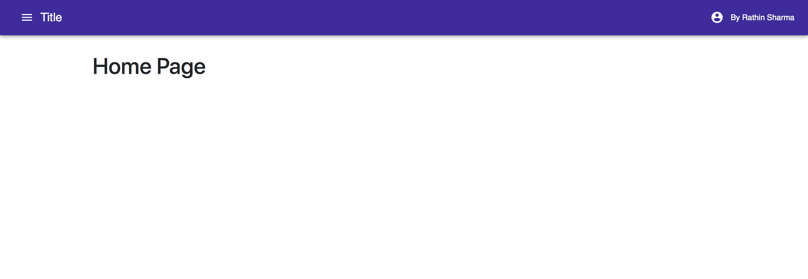
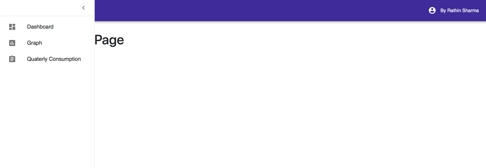

No need to write the code from scratch, just download this repository and npm install

This starter template includes:

 1. React.js
 2. Material UI
 3. Reactstrap + Bootstrap
 4. React Router
 5. A page + drawer
 
 Directory Structure of src folder:
  
  -- src  
   &nbsp; - components  
   &nbsp; - pages  
   &nbsp; - styles
    
 The methodology that I follow up here is that one or more page has some resuable components and you can either include the style in the component file or put in styles folder by referring with the component name.
 
<strong>Please feel free to contribute! Thank you</strong>
 
 
<h3> Home Page [A sample] </h3>

<h3> Drawer </h3>

